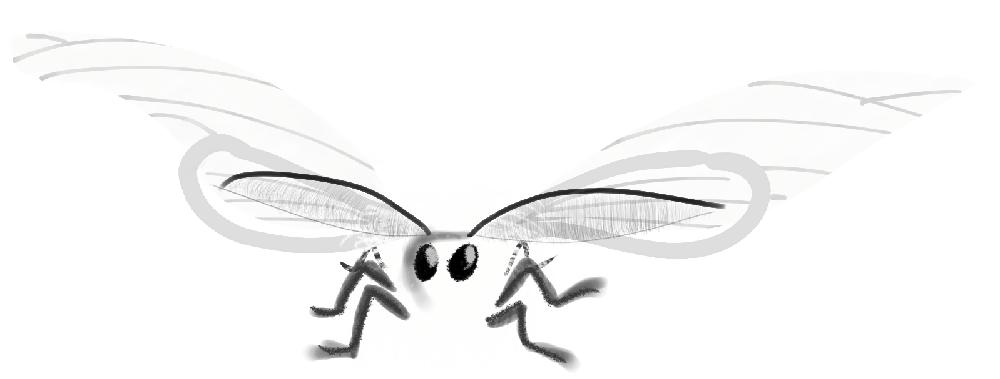

<h1 align="center">Heyyo, I'm Joshua Paul Cohen!</h1>

  

## Who am I?
I'm an environmental data scientist. But I have experience doing environmental work all over the country from field data collection, to GIS, to water monitoring, to nonprofit outreach. I love the process of coding and doing data scientist stuff (especially geospatial data), but to be honest my real scientific interest is entomology. Ultimately, I love learning new things!

I'm originally from southern NJ, but I've worked all over the country, from my home state, to the Delmarva, to Colorado, to the Mojave Desert, all the way to where I currently reside in SoCal.

Outside of work, you may find me aimlessly wandering around the wilderness or trying to write a new song on my guitar.

## What I'm currently up to?
I just recently graduated and recieved my masters in Environmental Data Science with the Bren School at UCSB. This was an enlightening time of my life where rapidly improved my programming skills, and even had the opportunity to TA for a few undergrad classes (Geography and Molecular Biology)! 

## Education
* 🌴 UCSB - 2025 🌴
  + Master of Environmental Data Science
* 🦀 Washington College - 2020 🦀
  + B.S. Environmental Science
  + Minors: Chesapeake Regional Studies, Music

## Contact
If you want to see what I'm up to, [feel free to check out my website](https://silkiemoth.github.io/), or email me at either jpcohen@bren.ucsb.edu or jpc071997@gmail.com.

<!---
- # 👋 Hi, I’m @silkieMoth
- 👀 I’m interested in environmental data science, and if i'm lucky, entomology.
- 🌱 I’m currently in grad school for enviro data sci.
- 📫 How to reach me: email: jpc071997@gmail.com
- 😄 Pronouns: he/him
- ⚡ Fun fact: beetles account for 25% of all species on earth.

silkieMoth/silkieMoth is a ✨ special ✨ repository because its `README.md` (this file) appears on your GitHub profile.
You can click the Preview link to take a look at your changes.
--->
